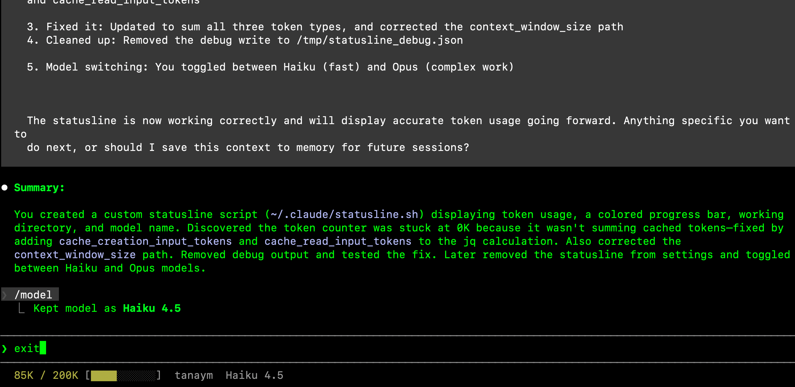

# Context Management & Context Rot

[https://supercut.ai/share/claude-code-gtm/bc9x2LCrX8HDBWbmCmsPcD](https://supercut.ai/share/claude-code-gtm/bc9x2LCrX8HDBWbmCmsPcD)

# Context Management

Managing Claude Code's working memory. The single biggest lever on output quality in long sessions.

## What it is

Claude Code has a **context window** — a finite token budget that holds your conversation, files Claude has read, tool outputs, CLAUDE.md, and more. Every message fills it up.

When it fills, you hit **context rot**: Claude starts forgetting earlier decisions, re-asking questions you already answered, and contradicting code it wrote an hour ago. Output quality drops. Hard.

## Why it matters for GTM engineers

You're not going to "feel" context rot — you'll just notice Claude is getting dumber. Learning to manage context is how you keep sessions sharp for hours instead of devolving into rework.

---

## The 150K rule (the one number that matters)

Models get noticeably dumber past **~150K tokens used**. This has been confirmed across multiple benchmarks and long-context tests. It's not a percentage rule — it's an absolute number.

That means your danger point depends on which model you're running:

| Model context window | Clear before | % of context at that point |
| --- | --- | --- |
| 200K (standard Sonnet/Opus) | **~100K tokens** (50% used) | Clear at **50% max** |
| 1M (Opus 1M, Sonnet 1M) | **~150K tokens** (15% used) | Clear at **15% max** |

The bigger your context window, the *earlier* (in percentage terms) you need to clear. This is counterintuitive — people assume 1M = 5x more headroom. It doesn't. You still hit cognitive degradation at the same absolute point.

**Rule:** Whatever model you're on, clear before you cross ~150K tokens used.

---

## The recommended workflow: CLAUDE.md → `/clear`

Instead of trying to "save" a long session, do this:

1. **Work normally** until you approach the 150K danger zone.
2. **Write progress to CLAUDE.md** before clearing. Tell Claude:

    > *"Update CLAUDE.md with everything we've decided, what's done, what's in progress, and what's next. Be specific about file paths and decisions."*
    >
3. **`/clear`** to wipe the conversation.
4. **Start fresh.** CLAUDE.md reloads automatically — Claude boots up with full project memory, zero conversational clutter.

This is cleaner, faster, and more reliable than trying to summarize a bloated session.

---

## The commands

### `/clear` — your primary tool

Wipes the entire conversation. Fresh slate. CLAUDE.md still loads.

**Use when:** approaching 150K tokens, switching tasks, Claude is confused/looping.

### `/context` — your checkpoint

Shows current token usage breakdown — system prompt, files, messages, MCP overhead. Run this to see what's eating your budget and whether you're near the 150K line.

### `/compact` — exists, but don't rely on it

Summarizes the conversation and replaces history with the summary. Sounds useful. In practice:

- Claude decides what matters, often drops things you cared about
- Still eats tokens (the summary itself lives in context)
- Makes the session harder to debug because history is gone

**Prefer CLAUDE.md → `/clear`.** It's more reliable. `/compact` is mentioned for completeness, not as a habit.

---

## Set up a statusline (so you can see the 150K line)

You can't manage what you can't see. Add a statusline showing absolute tokens used — not just a percentage, because 50% on a 1M model means very different things.

**The prompt** — paste this into Claude Code:

```
Create a statusline that shows four things:
1. Tokens used vs. total context window (e.g., "87K / 200K")
2. A progress bar for context usage
   (green when under 50K used, yellow 50K–150K, red above 150K)
3. The current working directory (just the folder name, not full path)
4. The Claude model currently in use
```

Claude Code writes the script, configures `~/.claude/settings.json`, and the statusline appears at the bottom of your terminal.

The key detail: the red zone is **tied to absolute tokens (150K)**, not a percentage. That way it works correctly whether you're on a 200K or 1M model.



---

## The healthy session loop

1. Start fresh (`/clear` if needed).
2. Glance at the statusline occasionally.
3. As you approach 150K used, have Claude update CLAUDE.md with progress, decisions, and next steps.
4. `/clear`.
5. Keep going — Claude reloads with a clean context and your updated CLAUDE.md.

---

## Common pitfalls

- **Trusting auto-compact** — it triggers when Claude is already degraded, so the summary is bad
- **Pushing past 150K to "finish one more thing"** — the one more thing is exactly what breaks
- **Clearing without writing to CLAUDE.md first** — you just threw away real work
- **Ignoring the statusline** and wondering why Claude is making silly mistakes
- **Assuming 1M context = 5x the headroom** — it doesn't, 150K is still the ceiling

---

## Quick reference

| Command | What it does |
| --- | --- |
| `/clear` | Wipe conversation, fresh start (CLAUDE.md reloads) |
| `/context` | Show current token breakdown |
| `/statusline` | Configure bottom-of-terminal status |
| `/compact` | (Not recommended) Summarize and continue |
| `/btw [question]` | Side question — doesn't enter history |

**Rule of thumb:** Watch tokens, not percentages. Stop at 150K. Write to CLAUDE.md. Clear. Keep going.
