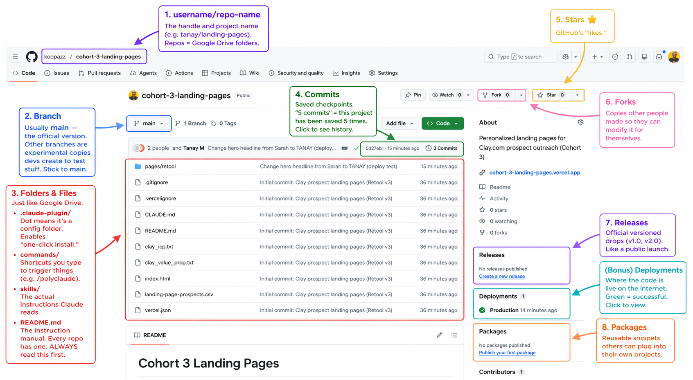

# Introduction to GitHub

## The Mental Model

**GitHub is Dropbox (or Google Drive) for code.**

That's it. Cloud storage where developers save their projects. Each project lives in a "repo" (short for *repository*) — think of it as a Google Drive folder.

The one thing that makes it different: GitHub tracks every change you make, so you can rewind to any previous version. That's what **Git** does. **GitHub** is just the website that hosts Git projects.

---

## Anatomy of a Repo

When you land on a GitHub repo, here's what you're looking at:

- **`username/repo-name`** (top bar) — the handle and project name (e.g. `tanay/landing-pages`). Repos = Google Drive folders.
- **Branch** (usually `main`) — the official version. Other branches are experimental copies devs create to test stuff. Stick to `main`.
- **Folders & files** — just like Drive.
    - `.claude-plugin/` → the dot means it's a config folder. Enables "one-click install."
    - `commands/` → shortcuts you type to trigger things (e.g. `/polyclaude`).
    - `skills/` → the actual instructions Claude reads.
    - `README.md` → the instruction manual. Every repo has one. **Always read this first.**
- **Commits** — saved checkpoints. "5 commits" = this project has been saved 5 times. Click to see history.
- **Stars ⭐** — GitHub's "likes."
- **Forks** — copies other people made so they can modify it for themselves.
- **Releases** — official versioned drops (v1.0, v2.0). Like a public launch.
- **Packages** — reusable snippets others can plug into their own projects.

---

## The Only Git You Need (For Now)

Git has ~50 commands. You need **two**:

1. **Commit** → Save your game
2. **Restore** → Reload last checkpoint

Everything else is a variation of these two.

---

## The Shortcut

**Claude Code knows Git better than you or I ever will.**

Don't memorize commands. Don't Google syntax. Just tell Claude what you want:

- *"Commit this with a message about what I just changed."*
- *"Restore to the last working version."*
- *"Create a new branch so I can test this without breaking anything."*

Claude runs the operation. You stay focused on building.
