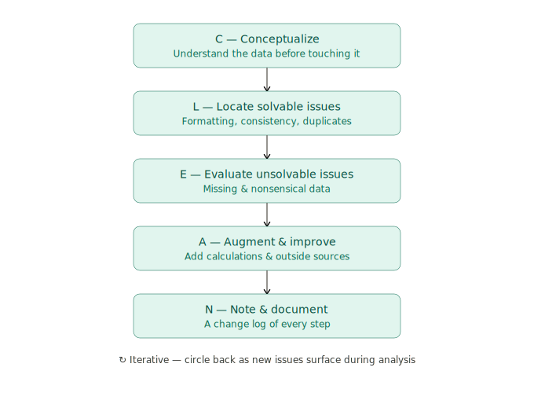

# Project #2 — CSV Cleanup & Enrichment (messy export → CRM-ready)

> **Full tutorial, uncut:** [YouTube livestream](https://youtube.com/live/hGc3fYiSpVA)

> **Stop. Read this before you touch anything else in this folder.**

## Don't copy this project.

If you clone this folder, run my `clean.py` against my CSV, and call it done — you wasted an hour. You didn't learn anything, and you have a cleaning script hard-wired to *my* data's quirks, not yours. Your messy export has different columns, different junk, and different rules for what "clean" means.

The point of GTM Goldmine is not the code. **The point is the method.** Point Claude Code at *your* messy file, make it analyze the actual problems, plan the pipeline with you, and build a cleaner that fits *your* data — with Claude Code holding the keyboard and you holding the spec.

---

## The CLEAN framework

Every step in `clean.py` follows **CLEAN** — a five-stage, iterative approach to data cleaning. Understand the data before you touch it, fix what's fixable, make a call on what isn't, enrich, and document every change.

<p align="center">
  
</p>

> **Framework credit:** [Christine Jiang](https://www.youtube.com/watch?v=iYEw8L3Un4c). The CLEAN methodology this build runs on comes from her walkthrough — worth watching before you clean anything of your own.

---

## Build your own version.

**Time:** ~45–60 minutes.
**Prereqs:**
- Claude Code installed → see [`Foundations/01-Setup`](../../Foundations/01-Setup/)
- A real, messy CSV you actually need cleaned (a lead list, a CRM export, a visitor de-anon dump — whatever's been sitting in your downloads folder)
- A clear idea of where it's going next (HubSpot? Salesforce? Clay? a cold email tool?) — the destination dictates the rules
- Python 3 with `pandas` (Claude will set this up if you don't have it)

### Step 1 — Open Claude Code in a new, empty folder

```bash
mkdir my-csv-cleanup && cd my-csv-cleanup
# drop your messy CSV into this folder, then:
claude
```

### Step 2 — Paste this prompt, verbatim

```
In this project there is a CSV file, and my job as a GTM engineer is to
clean it and get it ready for import. I do NOT want to copy Project #2
from the GTM Goldmine repo (https://github.com/Clay-Bootcamp/gtme-goldmine)
— I want my own cleaner, tailored to MY file and MY destination.

We are NOT cleaning anything yet. I want to spend real time planning and
making sure you understand the data before we touch a single record.

Do this in order:

1. Analyze the CSV first — structure, row/column counts, duplicates, and
   every data-quality problem you can find (whitespace, casing, junk in
   names, malformed URLs, missing fields, inconsistent values, dupes,
   future/invalid dates). Show me what you found.

2. Then ask me 5 high-signal questions covering:
   - Where this file is going next, and what "import-ready" means for
     that destination (HubSpot / Salesforce / Clay / email tool / etc.)
   - Which rows are worth keeping vs. discarding (what's my rule for
     "un-usable" — no email? no LinkedIn? no company?)
   - How to handle duplicates — collapse to one row per person/company,
     and which record wins when fields conflict
   - Edge cases and what to do with them: flag for review vs. auto-fix
     vs. drop (non-Latin names, weird dates, unparseable URLs, blanks)
   - Output format — one clean file, or clean + a "needs-review" flag
     file; which columns, renamed how, derived fields I want added

3. Wait for my answers. Do not proceed until I've answered all 5.

4. Then switch into plan mode (Shift+Tab twice) and draft the cleaning
   pipeline: every step in order, what each step does, and what files
   you'll produce. Treat my raw file as READ-ONLY — back it up and never
   write to the original. Do NOT build anything yet. Wait for approval.

5. Once I approve, exit plan mode, build the cleaner, run it, and produce
   an audit log documenting every change and every row dropped or flagged.

Start by analyzing the CSV.
```

### Step 3 — Answer the questions like you mean it

No "you decide." Cleaning rules are *business* decisions, not technical ones. Whether a no-email row gets dropped or kept, whether two near-duplicate companies merge — only you know. Every lazy answer here ships bad data into your CRM, which is worse than no data.

### Step 4 — Read the plan. Push back if it's wrong.

The pipeline order matters. Dropping rows before deduping gives a different result than deduping first. Make sure the plan treats your raw file as read-only and produces an audit trail. If a step is wrong, say so before it runs against 600 rows.

### Step 5 — Build

Exit plan mode, approve, watch it run. Then **read the audit log** — it tells you exactly what changed and what got flagged. Spot-check the flagged file by hand before you import anything.

---

## Why this works

This is the **Golden Prompts Framework**: *Think → Ask → Plan → Build*. The twist for data work is that the "Think" step is **analysis first** — Claude reads your actual file and surfaces the real problems before anyone decides on rules. It's how you get a cleaner built for your data, not a generic script that mangles it. Full breakdown: [`Foundations/03-Golden-Prompts-Framework.md`](../../Foundations/03-Golden-Prompts-Framework.md).

Every project in this repo follows the same pattern. Copying any of them is missing the entire point.

---

## What's actually in this folder

For reference only — so you can see what I shipped on stream for *my* file (a synthetic RB2B website-visitor de-anon export, cleaned for HubSpot import). The data is **fake** — generated for the stream — so it's safe to look at. **Don't ship my script as yours; it's tuned to these exact quirks.**

- `clean.py` — the cleaning pipeline I built live. Reads the raw file **read-only**, runs the CLEAN framework (Conceptualize → Locate → Evaluate → Augment → Note), writes the outputs + an audit log
- `deanon_export.csv` — the raw, messy input (642 rows / 400 people, with whitespace, ALL-CAPS names, "✨ Open to Work" badges, mixed-case LinkedIn URLs, dupes)
- `deanon_cleaned.csv` — the cleaned output (331 import-ready contacts, one row per person, page visits aggregated into a `notes` field)
- `flag.csv` — 33 records held back for manual review instead of silently auto-fixing them
- `cleaning_audit.md` — the full change log: every step, every row dropped, every flag reason, with before/after counts and reconciliation checks

To run it yourself: `pip install pandas` then `python clean.py` from inside this folder. It regenerates `deanon_cleaned.csv`, `flag.csv`, and `cleaning_audit.md` from the raw export.
